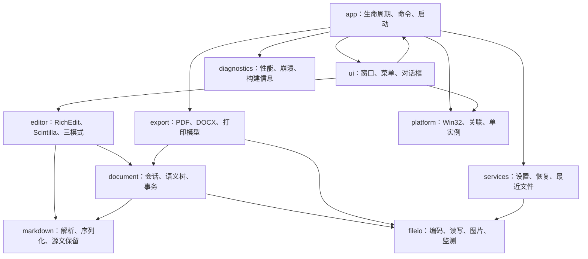
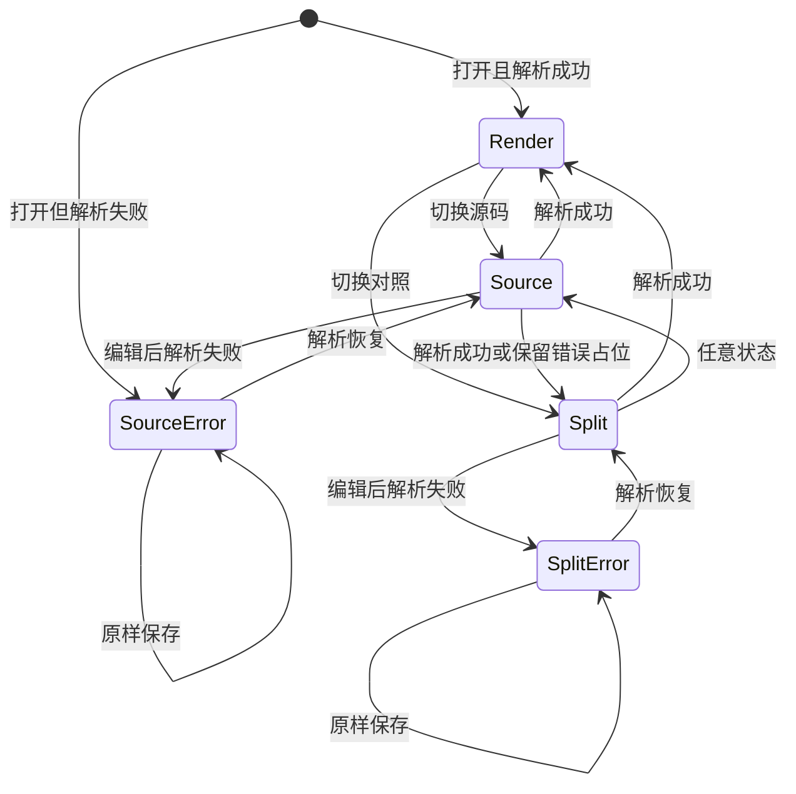

# 马冬梅（Markdown May）总体设计说明书

> 文档编号：MM-HLD-001
> 版本：1.0
> 需求基线：`需求规格说明书_V02.md` 1.0
> 状态：瀑布第二阶段交付物

## 1. 目的与范围

本文把冻结需求转换为系统级设计，规定模块边界、依赖方向、运行时组件、数据所有权、三模式同步、线程、持久化、导出和平台集成。详细的类、函数、状态和算法见《详细设计说明书》；公共 C++ 接口见 `design/include/markdownmay/`。

设计目标按优先级排列：

1. 不丢失用户 Markdown 源文；
2. 三种模式不分叉、不用旧渲染冒充当前内容；
3. Windows 中文输入、文件操作和系统集成可靠；
4. 单 EXE、快速启动、低内存；
5. 结构可测试、可追踪、可由 AI 按文件实施。

## 2. 关键设计决策

| 编号 | 决策 | 原因 |
| --- | --- | --- |
| ADR-001 | C++20、MSVC、Win32 | 原生、小体积、快速启动、系统集成直接 |
| ADR-002 | RichEdit 承担渲染模式编辑 | 利用系统 IME、选区、无障碍、基础富文本 |
| ADR-003 | Scintilla 静态链接，承担源码编辑 | 源码文本、高亮、行列、错误标记成熟 |
| ADR-004 | MD4C 静态链接 | 小型、CommonMark/GFM 能力明确 |
| ADR-005 | Markdown 源文本始终可以保存 | 源码语法错误时优先保护用户输入 |
| ADR-006 | 语义文档只代表最近一次成功解析版本 | 禁止用无效源码构造半真半假的模型 |
| ADR-007 | 所有视图带版本号 | 判断模型、源码、渲染和导出是否一致 |
| ADR-008 | UI 线程拥有可变文档会话 | 避免跨线程同时修改编辑状态 |
| ADR-009 | 后台任务只接收不可变快照 | 解析、图片解码、导出不直接碰 UI 对象 |
| ADR-010 | 设置写 LocalAppData，资源编译进 EXE | 单 EXE 可从只读目录运行 |
| ADR-011 | PDF/DOCX 由语义文档导出 | 不截图，不依赖屏幕布局 |
| ADR-012 | 错误使用稳定错误码和 `Result<T>` | 禁止异常跨模块边界传播 |

## 3. 系统上下文

```mermaid
flowchart LR
    U["用户"] --> APP["MarkdownMay.exe"]
    FS["本地文件系统"] <--> APP
    REG["当前用户注册表"] <--> APP
    SHELL["Windows Shell"] <--> APP
    PRINT["Windows 打印系统"] <-- APP
    WORD["Word / WPS"] <-- DOCX["导出的 DOCX"]
    PDFR["PDF 阅读器"] <-- PDF["导出的 PDF"]
    APP --> DOCX
    APP --> PDF
    APP -. "不访问" .-> NET["网络"]
```

## 4. 逻辑架构



禁止的依赖：

- `document`、`markdown`、`fileio` 不依赖 `ui`；
- `export` 不读取 RichEdit 或 Scintilla；
- `ui` 不直接调用 Win32 注册表和磁盘 API；
- `markdown` 不知道窗口、文件关联和导出；
- 不创建跨模块万能工具类或全局可变单例。

## 5. 运行时组件

### 5.1 单进程单 UI 线程

默认只有一个应用进程和一个 UI 线程。第二次启动通过命名管道把文件路径交给现有实例，然后退出。

进程内组件：

```text
Application
 ├─ MainWindow（当前 1.0 仅一个活动文档会话）
 │   ├─ ViewModeController
 │   │   ├─ RichEditHost
 │   │   ├─ SourceView
 │   │   └─ SplitView
 │   └─ CommandDispatcher
 ├─ DocumentSession
 ├─ BackgroundExecutor
 ├─ SettingsService
 ├─ RecoveryService
 └─ SingleInstanceServer
```

技术方案早期写过“多标签”，冻结需求没有要求多标签。1.0 采用单窗口单活动文档，打开另一个文件前按未保存流程处理。这样符合记事本定位并显著降低三模式状态复杂度。未来若用户提出多标签，必须走 CR 流程。

### 5.2 后台任务

后台线程池固定为最多 2 个工作线程，执行：

- 源码防抖后的 Markdown 解析；
- 图片解码和缩略；
- PDF/DOCX 导出；
- 大文件加载后的非关键计算。

任务携带 `DocumentId`、`SourceRevision` 和取消令牌。结果回到 UI 线程时，版本不匹配就丢弃，不得覆盖新状态。

## 6. 文档数据所有权

`DocumentSession` 是单个打开文档的聚合根，包含：

- 文档身份、路径、编码、换行符；
- 当前 Markdown 源文本 `SourceBuffer`；
- 当前源码修订号 `SourceRevision`；
- 最近成功解析的不可变 `SemanticDocument`；
- 该语义模型对应的 `ParsedRevision`；
- 磁盘已保存修订号 `SavedRevision`；
- 当前模式和三个视图的位置状态；
- 解析错误、外部修改和只读状态；
- 应用级撤销协调器。

核心不变量：

```text
ParsedRevision <= SourceRevision
SavedRevision <= SourceRevision
RenderRevision == ParsedRevision 或 RenderRevision 为空
ExportAllowed 当且仅当 ParsedRevision == SourceRevision 且文档校验通过
```

### 6.1 权威数据切换

| 用户动作 | 临时权威表示 | 提交结果 |
| --- | --- | --- |
| 渲染模式编辑 | 编辑事务中的语义模型 | 序列化为新源码，二者版本相同 |
| 源码模式编辑 | SourceBuffer | 解析成功后更新语义模型 |
| 对照左栏编辑 | SourceBuffer | 解析成功后更新右栏 |
| 打开文件 | 磁盘字节 | 解码为 SourceBuffer，再解析 |
| 保存 | 当前 SourceBuffer | 原子写入后更新 SavedRevision |
| 导出 | 最新 SemanticDocument | 仅在 ParsedRevision 等于 SourceRevision 时允许 |

## 7. 三模式状态机



规则：

- 默认模式是 `Render`；
- 文件初次解析失败则进入源码错误态，而不是显示空白渲染；
- 错误态可保存源码、撤销、重做和继续编辑；
- 错误态不能进入可编辑渲染模式，不能导出；
- 对照错误态右栏显示错误摘要和位置，不显示旧文档；
- 模式切换前提交 IME 组合输入和活动编辑事务；
- 视图位置用稳定节点 ID 加节点内偏移映射，失败时退化到最近源码行。

## 8. Markdown 解析与序列化

### 8.1 解析

MD4C 回调经 `SyntaxBuilder` 构建不可变语义树。每个节点具有：

- `NodeId`：在一次会话中稳定；
- `NodeKind`；
- `SourceRange`：UTF-8 字节范围；
- 块/行内属性；
- 子节点；
- 未识别内容的原始字节。

局部编辑后优先按受影响块重新解析；若边界不安全则整篇解析。第一实现可以先整篇解析，但接口必须保留局部解析能力，性能测试决定何时启用。

### 8.2 序列化

- 渲染模式编辑后由 `MarkdownWriter` 生成规范化 Markdown；
- 源码模式不做无意义重写，直接保存 SourceBuffer；
- 未修改的未知块由 `SourcePreserver` 原样复制；
- 新文件输出 UTF-8 无 BOM、CRLF；
- 已有文件保留可识别编码和换行符。

## 9. 图片生命周期

图片分为：

1. **受管图片**：位于当前文档 `<文档名>.assets`；
2. **外部本地图片**：其他本地路径；
3. **远程图片引用**：HTTP/HTTPS，仅保留地址并显示占位符。

删除引用：

- 受管图片且当前文档无剩余引用：原子重命名为 `del_原名`；
- 重名依次使用 `del_2_`、`del_3_`；
- 外部图片和仍被引用的图片不改名；
- 撤销记录原路径和删除标记路径，安全时恢复；
- 永不自动永久删除图片。

重命名和文档编辑属于一个复合事务。若重命名失败，文档引用删除仍可继续，但必须提示“图片文件未标记”；不得因此损坏文档。

## 10. 文件读写

打开流程：

```text
规范化路径 → 读取字节 → 检测 BOM/编码 → 解码为 UTF-8 内部文本
→ 检测换行 → 建立 SourceBuffer → 解析 → 建立会话 → 投影视图
```

保存流程：

```text
取得 SourceBuffer 快照 → 转换原编码/换行 → 同目录唯一临时文件
→ 写入并 FlushFileBuffers → 保留必要文件属性 → ReplaceFile
→ 更新磁盘身份和 SavedRevision
```

外部修改通过目录变更通知和文件身份二次核验，避免仅比较时间戳。

## 11. PDF 与 DOCX 导出

`ExportDocument` 是与 UI 无关的不可变中间模型，由最新语义文档建立。

PDF：

- 自有轻量 PDF writer；
- DirectWrite 提供字形和度量；
- 中文字体子集嵌入；
- 两遍布局：先测量分页，再写对象和交叉引用；
- 临时文件成功完成后原子替换目标文件。

DOCX：

- 生成 Open XML 部件；
- miniz 静态打包 ZIP；
- 标题、列表、表格、链接、图片映射到 Word 原生结构；
- 先写临时包，完成关系校验后替换。

导出只读取固定修订快照。用户继续编辑不影响正在导出的内容；界面显示“正在导出文档修订 N”。取消时删除临时文件。

## 12. UI 与命令

所有操作映射到稳定 `CommandId`，菜单、工具栏和快捷键不直接修改文档。

```text
UI 事件 → CommandDispatcher → 查询 CanExecute
→ Editor/Document/Application 服务 → Result
→ UI 显示状态或错误
```

命令可用性由 `CommandContext` 决定，包括当前模式、选区、只读、解析状态、导出状态和未保存状态。

## 13. 错误处理

- 公共接口返回 `Result<T>` 或 `Status`；
- 错误包含稳定 `ErrorCode`、严重级别、系统错误、参数和来源；
- UI 使用错误码查找中文模板；
- 内部异常在模块边界转换为错误，禁止穿过 Win32 消息过程；
- 日志只记录错误码、模块、系统码、耗时和路径哈希，不记录正文；
- `Fatal` 只用于无法维持进程不变量的情况。

完整编号见《错误码表》。

## 14. 配置与本地数据

```text
%LOCALAPPDATA%\MarkdownMay\
  settings.ini
  recent.ini
  recovery\
  logs\
```

配置使用 UTF-8 INI，自行实现有限键值读取，避免引入 JSON 库。损坏配置改名为 `.bad-时间戳` 后使用默认值。

## 15. 系统集成

- 文件关联只写 `HKCU\Software\Classes`；
- 注册当前 EXE 绝对路径，移动后提示修复；
- 默认应用最终选择由 Windows 完成；
- 单实例使用当前用户 SID 派生的互斥体和命名管道名称；
- 进程间消息使用长度前缀 UTF-8 JSON 不合算，改用固定二进制头加 UTF-16 路径数组；
- 链接交给 `ShellExecuteEx`；远程图片绝不请求网络。

## 16. 构建与发布

- `/std:c++20`、Unicode、x64；
- MSVC 静态运行库 `/MT`；
- Release 启用 `/O2`、`/GL`、`/LTCG`、`/OPT:REF`、`/OPT:ICF`；
- 启用 `/W4`、`/permissive-`、`/guard:cf`、`/DYNAMICBASE`、`/NXCOMPAT`；
- 第三方库静态链接；
- 图标、字符串、清单编译进资源；
- PDB 单独归档，不随单 EXE 用户发布物分发。

## 17. 测试架构

| 层 | 范围 |
| --- | --- |
| 单元测试 | 文档树、解析、序列化、编码、路径、错误 |
| 契约测试 | 每个公共接口的前置/后置条件 |
| 往返测试 | Markdown 打开、编辑、保存、重开 |
| 集成测试 | 三模式、图片事务、文件变更、恢复、导出 |
| UI 测试 | Win32、RichEdit、Scintilla、IME、DPI、无障碍 |
| 黄金测试 | PDF 页面、DOCX XML/关系、规范化 Markdown |
| 性能测试 | 冷启动、1/10 MB、图片、导出、输入延迟 |

## 18. 需求追溯

实现不得只引用本文件。功能任务必须同时引用：

1. `需求规格说明书_V02.md` 中的需求编号；
2. 《功能模块与变更影响矩阵》中的功能行；
3. 《详细设计说明书》中的组件编号；
4. 接口头文件；
5. 对应测试目录；
6. 《错误码表》中的错误范围。

## 19. 设计阶段未留给编码者的自由项

以下内容不得由编码 AI 临时选择：

- 不得更换 GUI、编辑器或 Markdown 库；
- 不得增加联网、遥测、更新和账号；
- 不得把三模式实现成三份文档；
- 不得导出旧语义版本；
- 不得自动删除图片；
- 不得使用异常作为正常跨模块控制流；
- 不得引入未登记依赖；
- 不得把业务逻辑写进窗口过程。

## 18. V03 大纲设计变更（DC-2026-002）

主文档容器在编辑表面左侧装配固定 `OutlineView`。它只读取当前 `DocumentSession` 有效语义文档中的 H1～H6，按源顺序生成同字体、同字号、仅层级缩进不同的列表，不建立第二套正文状态。菜单和状态栏通过同一 `view_outline` 命令切换显示；点击项目由 `ViewModeController` 将标题源位置映射到当前渲染、源码或对照表面。显示偏好写入本地 INI V3，大纲不进入保存、打印和导出内容。

2026-08-10 优化增量：大纲仅在当前有效语义文档含标题且用户显示意图开启时装配可见；左侧大纲与正文、对照模式左右表面均使用原生可拖动分隔条。大纲列表启用水平滚动范围。状态栏“大纲”移至最左侧。对照返回渲染模式时在隐藏旧分栏后重建并同步重绘活动 RichEdit，消除失效区域残留。
