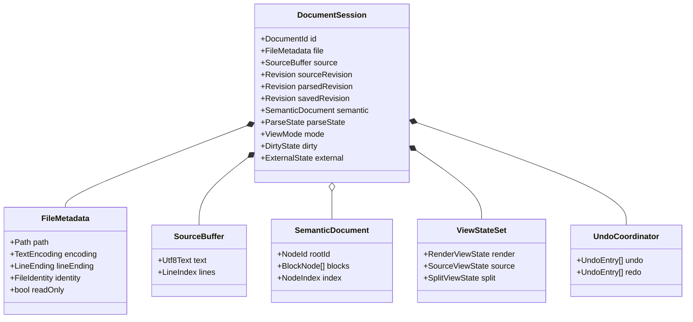
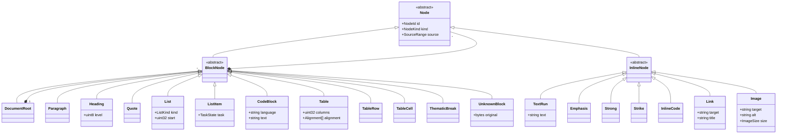
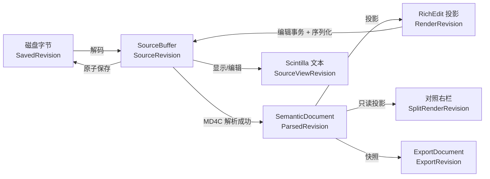
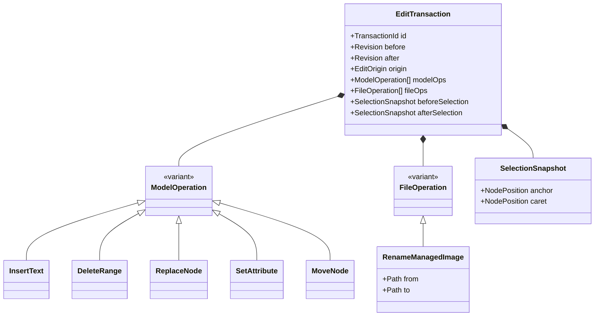
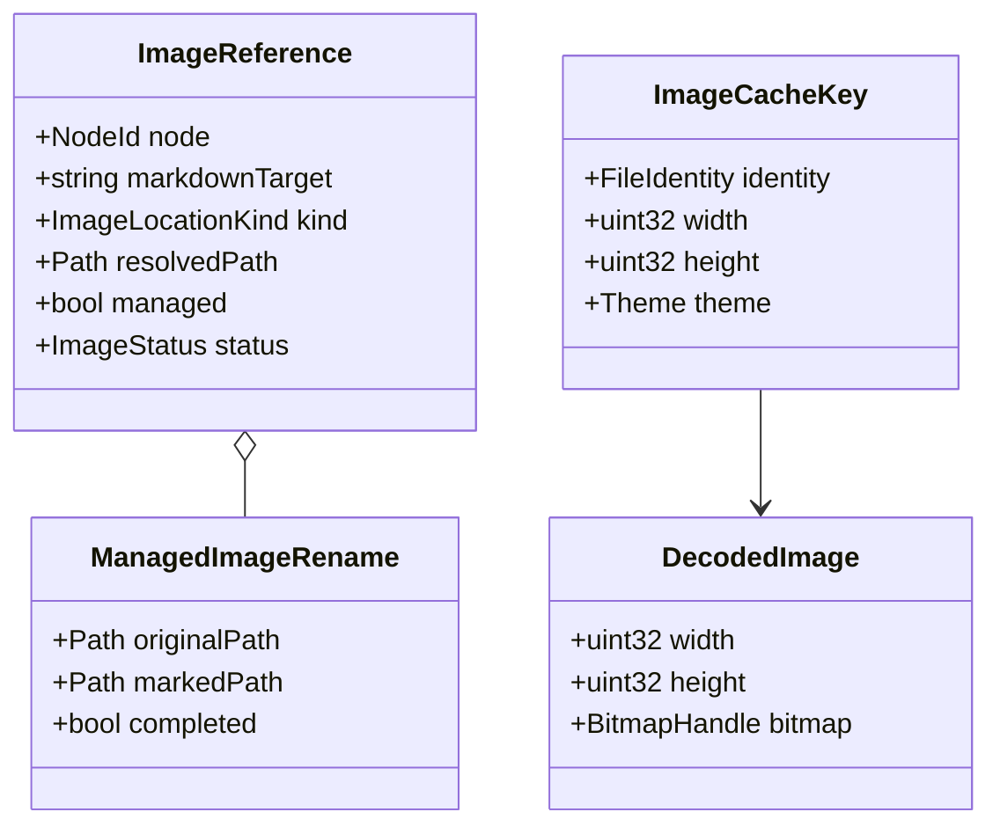
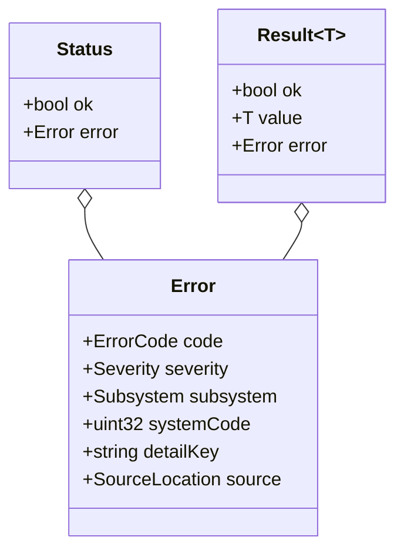

# 马冬梅数据结构图

> 文档编号：MM-DATA-001
> 版本：1.0
> 对应需求基线：V02 1.0

## 1. 文档会话聚合



## 2. 语义文档树



## 3. 版本与投影关系



版本不变量：

```text
ParsedRevision <= SourceRevision
SavedRevision <= SourceRevision
RenderRevision = ParsedRevision
SplitRenderRevision = ParsedRevision
ExportRevision = SourceRevision 仅当 ParsedRevision = SourceRevision
```

## 4. 编辑事务



## 5. 图片数据



## 6. 错误对象



## 7. 枚举基线

```text
ViewMode        = Render | Source | Split
ParseState      = Empty | Parsing | Valid | Invalid
DirtyState      = Clean | Modified | RecoveryOnly
ExternalState   = Unchanged | Changed | Deleted | Replaced
TextEncoding    = Utf8 | Utf8Bom | Utf16Le | Utf16Be
LineEnding      = CrLf | Lf | Mixed
ImageLocation   = Managed | ExternalLocal | Remote | Missing
TaskState       = None | Unchecked | Checked
Severity        = Info | Warning | Error | Fatal
```
